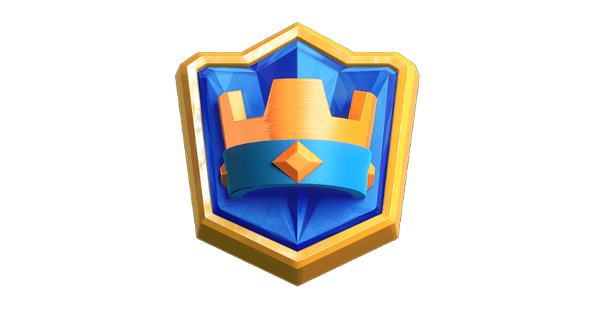
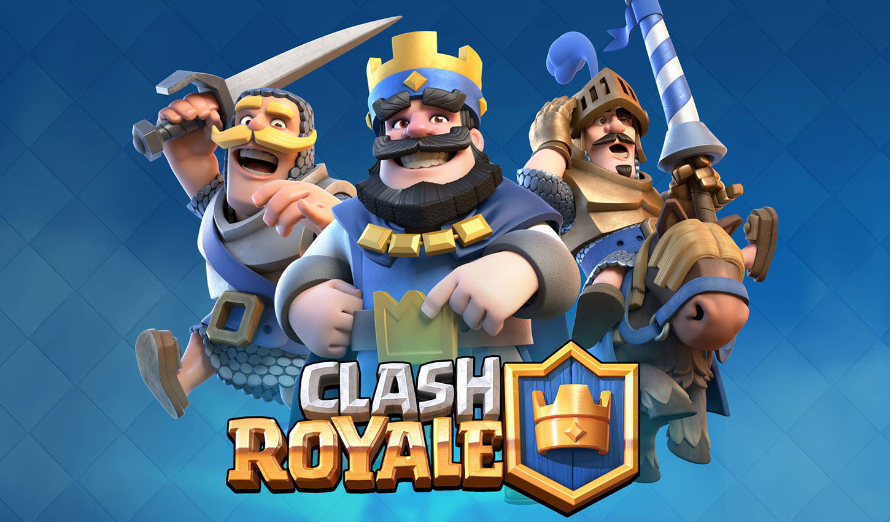

<!-- Improved compatibility of back to top link: See: https://github.com/othneildrew/Best-README-Template/pull/73 -->
<a name="readme-top"></a>
<!--
*** Thanks for checking out the Best-README-Template. If you have a suggestion
*** that would make this better, please fork the repo and create a pull request
*** or simply open an issue with the tag "enhancement".
*** Don't forget to give the project a star!
*** Thanks again! Now go create something AMAZING! :D
-->


<!-- PROJECT LOGO -->
<br />
<div align="center">
  <a href="https://github.com/paniniDot/ClashRoyale-OOPProject">
    
  </a>

<h3 align="center">Clash Royale clone</h3>

  <p align="center">
    A Clash Royale simplified clone for OOP course. 
</div>


<!-- TABLE OF CONTENTS -->
<details>
  <summary>Table of Contents</summary>
  <ol>
    <li>
      <a href="#about-the-project">About The Project</a>
    </li>
    <li>
      <a href="#getting-started">Getting Started</a>
      <ul>
        <li><a href="#installation">Installation</a></li>
      </ul>
    </li>
    <li><a href="#usage">Usage</a></li>
    <li><a href="#roadmap">Roadmap</a></li>
    <li><a href="#license">License</a></li>
    <li><a href="#contact">Contact</a></li>
  </ol>
</details>


<!-- ABOUT THE PROJECT -->
## About The Project
<br />
<div align="center">
  <a href="https://github.com/paniniDot/ClashRoyale-OOPProject">
    
  </a>
  <p align="center">
</div>
The goal of the project is to develop software that emulates the Clash Royale game, 
a well-known video game in the tower-defense category. Each player, equipped with a deck, consisting of four cards,
will have to face opponents of which he will try to destroy one or more towers to win the game. 
Victory is achieved by first destroying all three opposing towers or, at the end of the allotted time, 
by having more than the opponent destroyed. 
At the end of the game, if the player has won he will earn XP (which he will need to level up and upgrade 
the cards in his possession) and trophies, otherwise the latter will be stolen.


<p align="right">(<a href="#readme-top">back to top</a>)</p>


<!-- GETTING STARTED -->
### Installation

1. Clone the repo
   ```
   git clone git@github.com:paniniDot/ClashRoyale-OOPProject.git
   ```
3. build it (on linux):
   ```
   cd ClashRoyale-OOPProject
   gradle build
   ```
Alternatively you could just download the latest release and run it with
   ```
   java -jar clashroyale.jar
   ```

<p align="right">(<a href="#readme-top">back to top</a>)</p>


<!-- USAGE EXAMPLES -->
## Usage
The usage of the game is quite intuitive and quite similar to the original game interface.
Once started the game, a Menu screen will apear
<div align="center">
  <a href="https://github.com/paniniDot/ClashRoyale-OOPProject/">
    
  </a>
</div>
From it you can easily start a new game by pressing Battle button, this will create a new game 
<div align="center">
  <a href="https://github.com/paniniDot/ClashRoyale-OOPProject/">
    
  </a>
</div>
or choose which cards want to use, pressing Deck button
<div align="center">
  <a href="https://github.com/paniniDot/ClashRoyale-OOPProject/">
    
  </a>
</div>
You can also see your statistics, pressing Stats button
<div align="center">
  <a href="https://github.com/paniniDot/ClashRoyale-OOPProject/">
    
  </a>
</div>
<p align="right">(<a href="#readme-top">back to top</a>)</p>


<!-- ROADMAP -->
## Roadmap

Mandatory features:
- [X] Winning based ranking system (in throphies)
- [X] AI enemy implementation
- [X] 2D animated charachters (troops), using sprites
- [X] Fighting dynamics implementation
- [X] Elixir Handling
- [X] Statistics serialization
- [X] Troops path automatic path finding

Optional featues:
- [X] Custom deck
- [ ] Suddivision of cards by rarity
- [ ] Chests implementation
- [ ] Increasing difficulty AI
- [ ] Multiple language support
- [ ] Troops shadows
- [ ] Elixir production increasing 30 seconds from the match end
- [ ] Multiple arenas

<p align="right">(<a href="#readme-top">back to top</a>)</p>


<!-- LICENSE -->
## License

Distributed under the MIT License. See `LICENSE` for more information.

<p align="right">(<a href="#readme-top">back to top</a>)</p>


<!-- CONTACT -->
## Contact

Mattia Panni - mattia.panni@studio.unibo.it <br />
Riccardo Fiorani - riccardo.fiorani2@studio.unibo.it <br />
Simone Bollini - simone.bollini@studio.unibo.it <br />
Alexandro Salvato - alexandro.salvato@studio.unibo.it <br />

Project Link: [https://github.com/paniniDot/ClashRoyale-OOPProject/](https://github.com/paniniDot/ClashRoyale-OOPProject/)

<p align="right">(<a href="#readme-top">back to top</a>)</p>


<!-- MARKDOWN LINKS & IMAGES -->
[license-shield]: https://img.shields.io/github/license/github_username/ClashRoyale-OOPProject.svg?style=for-the-badge
[license-url]: https://github.com/paniniDot/ClashRoyale-OOPProject/blob/master/LICENSE
[product-screenshot]: images/secondLogo.jpg
